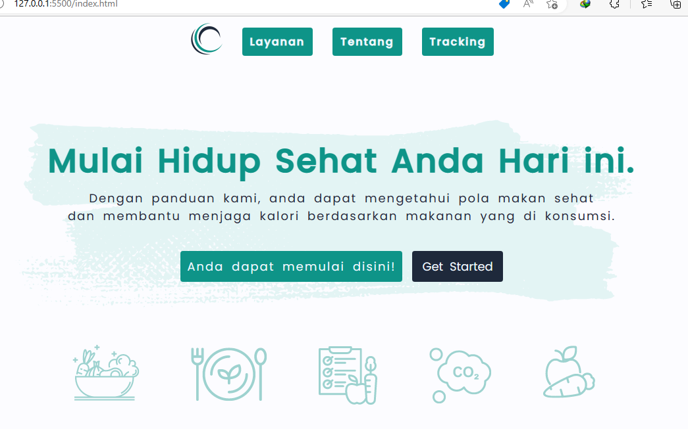

# Landing Page Baries
This Baries Page is about a website that contains a health platform and can guide someone to live a healthy life, diet programs, and programs to reduce carbon offsets based on human habits

## Form HTML
```html
<form class="register">
    <input type="text" id="name" name="name" placeholder="Masukan Nama" required/>
    <input type="text" id="city" name="city" placeholder="Masukan Nama Kota" required/>
    <input type="email" id="email" name="email" placeholder="Masukan alamat email" required/>
    <input type="number" id="zip-code" name="zip-code" placeholder="Masukan kode pos" required/>
    <label for="check" id="check">Dengan ini saya menyatakan data yang diisi pada form ini adalah benar dan telah sesuai </label>
    <input type="checkbox" id="status" name="status"/>
    <button type="submit" id="submit-form" onsubmit="submit()">Submit</button>
    <div id="warning"></div>
</form>
```

## Javascript
```javascript
const handleGetFormData = () => {
  const name = document.getElementById("name").value;
  const email = document.getElementById("email").value;
  const city = document.getElementById("city").value;
  const zipCode = document.getElementById("zip-code").value;
  const status = document.getElementById("status").checked;

  return { name, email, city, zipCode, status, };
};

function isNumber(string) {
  if (isNaN(string)) {
    return false;
  }
    return true;
}

const checkboxIsChecked = () => {
  const status = document.getElementById("status").checked;
  if (status) {
    return true;
  } else {
    return false;
  }
};

function validateFormData(data) {
  if (data.name == null || data.city == null || data.email == null || data.zipCode == null || !checkboxIsChecked().checked || !isNumber(data.zipCode)) return false;
  return true;
}

function submit() {
  event.preventDefault();
  const warning = document.getElementById("warning");
  if (!validateFormData(handleGetFormData())) {
    warning.style.display = "block";
    warning.innerHTML = "Periksa form Anda sekali Lagi!";
  } else {
    warning.innerHTML = "";
  }
}

const submitForm = document.getElementById("submit-form");
submitForm.addEventListener("click", submit);
```
## Results
<br>
<br>
<br>
<br>


### Link GitHub:  
Click to access all files in [GitHub](https://github.com/randiraaa/Landing-Page)

### link Netlify:
Click Landing Page [Baries](https://baries.netlify.app/)
